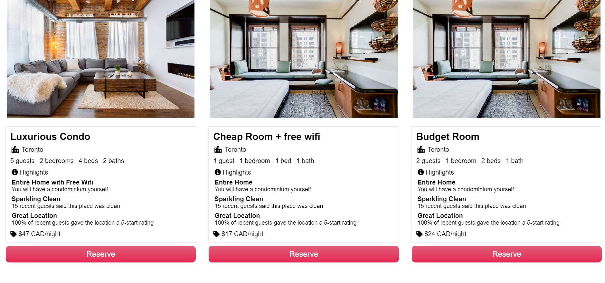

Airbnb-App Clone
================

**_Contents:_**
- [About](#about)
- [Author](#authors)
- [Features](#features)
- [Screenshots](#screenshots)
- [Live Documentation](#documentation)

# About

Airbnb clone app is a modern room booking application that allows users to book a room. This web app is inspired from Airbnb Web application and aims to implement its the features.

**Technology Stack**
- *Front End*: Express-Handlebars template engine
- *Back End*: Node, Express, MongoDB on the cloud, SendGrid for Emails, Twilio for text messaging
- *Live API Documentation*: Swagger

# Authors

[Kunal Dhawan](https://github.com/kunal-93)

# Features

- Admin Login - Has access to add, update, remove a room.
- User Registration
- User Login
- Room Booking
- Welcome Email after registration
- Live API documentation by swagger

# Screenshots
## Registration

## Login

## Landing Page

## User Dashboard

## Admin Dashboard

## Admin Edit Room options

## Search Rooms

## Book a room

## Update room by admin

## Responsive Design

Installation
------------

Install the by running:
1. clone the repo
2. npm i
3. Create a config folder in the root directory
4. create a config file keys.env
        SENDGRID_API_KEY={YourKey}
        PORT=3000
        TWILIO_SID={YourKey}
        TWILIO_TOKEN={YourKey}
        MONGO_DB_CONNECTION_STRING={YourKey}
5. run the code - node app

# documentation - powered by Swagger
----------
https://airbnb-kunal.herokuapp.com/api-docs

Contribute
----------

- Issue Tracker: github.com/kunal-93/Airbnb-App/issues
- Source Code: github.com/kunal-93/Airbnb-App

Coming Soon
----------

- User profile Page
- Room booking history